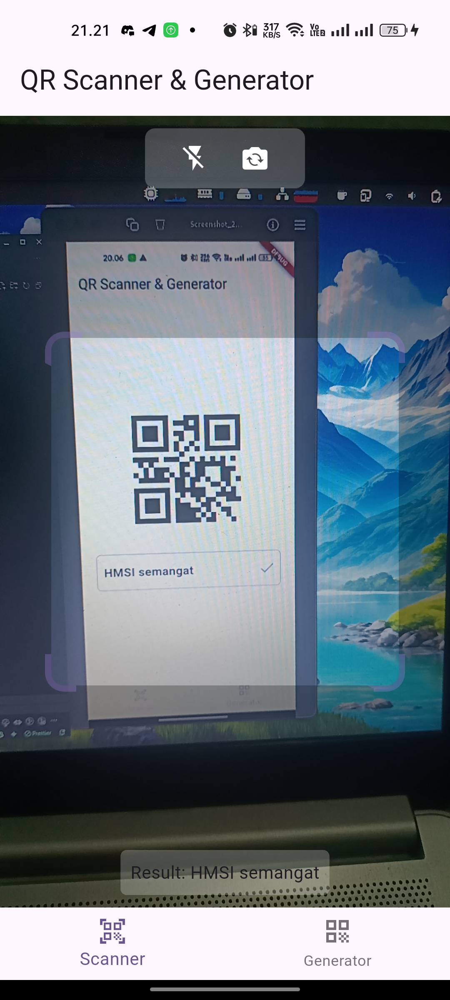
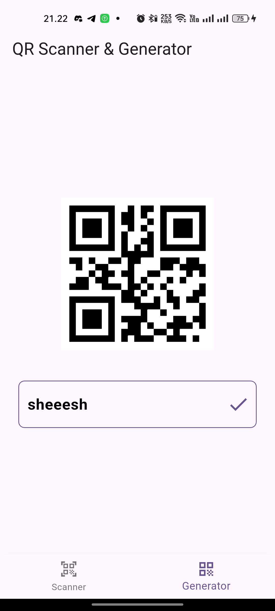

<a href="https://flutter.dev/">
  <h1 align="center">
    <picture>
      <source media="(prefers-color-scheme: dark)" srcset="https://storage.googleapis.com/cms-storage-bucket/6e19fee6b47b36ca613f.png">
      
    </picture>
  </h1>
</a>

   
   
   <!--   -->

---

# 📌 Overview

This Flutter app allows users to scan and generate QR codes effortlessly. It provides a simple and intuitive interface for scanning QR codes using the device's camera and generating custom QR codes for text, URLs, and other data.

---

## 📋 Previews

This the output application after running the project.

  
  

---

## 🧪 Getting Started

First we need to get package:

    flutter pub get

After that, we need to run our flutter application:

    flutter run

---

## ✨ About Us

- 💻 All of my projects/repository are available at [github.com/kisahtegar](https://github.com/kisahtegar)
- 📫 How to reach me **<code.kisahtegar@gmail.com>**
- 📄 Know about my experiences [kisahcode.web.app](https://kisahcode.web.app)
